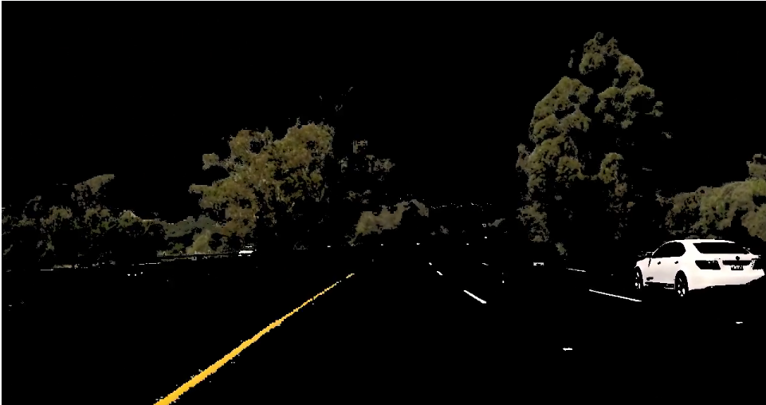
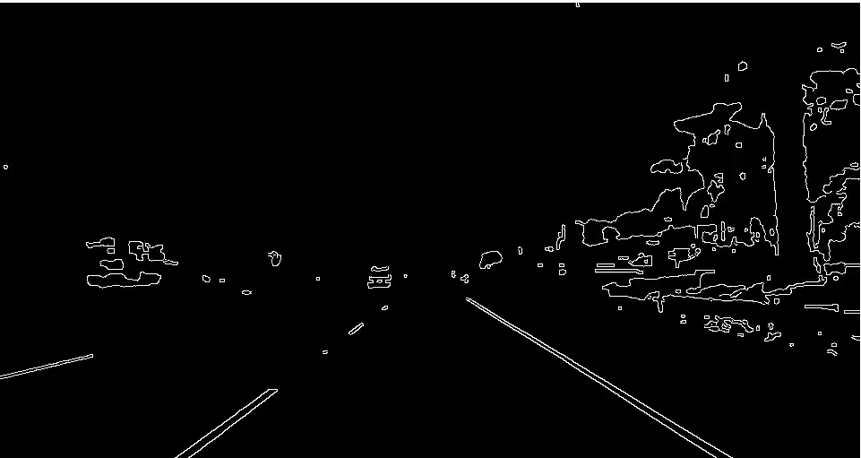
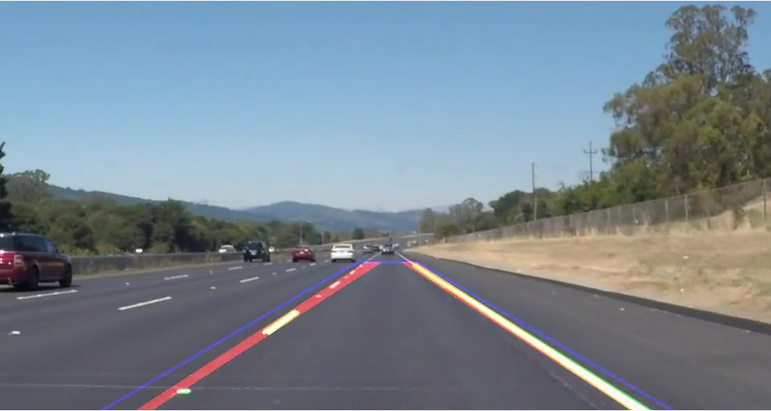

**Finding Lane Lines on the Road**

The goals / steps of this project are the following:
* Make a pipeline that finds lane lines on the road
* Reflect on your work in a written report

---

### Reflection

### Pipeline

The pipeline consists of 4 main steps:
* detect lines in the image (function highlight_edges)
* extract lines in the image to a list of lines (extract_lines)
* match one single line per side (approximate_line)
* render lines and optional debug information into the original frame

#### Edge detection

The most important step is the function highlight_edges as it also prepares the image for the edge detection. It consists of 4 parts.
Afterwards lines 

##### 1. Color filter
Using just a canny edge detection fails on frames with low contrast around the lane markings, especially in the extra challenge. To overcome this, I implemented a pre-filtering that uses color-matching to mask important parts of the image. White and light gray can easily be detected in RGB-color-space, but for yellow this is not possible, as it is a mixture. However, matching any color is simple in HSV color space. Color-masking is done as the initial step and produces output like this:

##### 2. Gaussian blur
The color-filtered image is blurred to reduce the contrast on the edges of the color-filter. Without blurring the edge-detection would recognize edges in every place where the masked modified pixels.

##### 3. Convert to gray-scale
Canny edge-detection works independent of any color, so convert to gray-scale.

##### 4. Run canny
Use opencv's Canny Edge Detection to highlight edges in the image. The output looks like this:

#### Line extraction

Line extraction is implemented inside the function extract_lines, which is run twice per frame - once per side of the viewport.
The reason why it is run once per side is that in the following step (approximate_line) one line is approximated out of all found line - separating lines already in this step simplifies the process as the input-image can easily be cut with a mask (generated by the function calculate_viewport.
The actual extraction is done y using opencv's HoughLinesP method with parameters that have been selected by trial and error on some of the provided examples.

### Line approximation

For each list of line segments (one list per side of the viewport) the function approximate_line is called to approximate one straight line.
To improve the result all segments that do not "point away" from the camera are removed from the list, then all start- and end-points of all segments are stored in a list of coordinates. This list is used as input of numpy's polyfit function which approximates a line with minimal distance to the points using a curve-fitting algorithm.

### Rendering

The final step is to render the two lines approximated by approximate_line into the original frame. As the lines are just polynomial curves they need to be "cut" so that they are not drawn above the horizon. The viewport is reused for this.
If enable, also the border of the used viewport and the "raw" detected lines can be embedded into the image, which then looks like this:

###2. Identify potential shortcomings with your current pipeline

The pipeline relies on a static viewport, it will not work when the lane-markings are out of this field, e.g. when taking turns or when switching lanes.
Another problem is that the approximated line is actually a straight line while in reality roads have curves. If the curves get to narrow (extra challenge is on the border of being to curvy), approximating a line is not correct but a curve, e.g. a clothoid, should be approximated.

###3. Suggest possible improvements to your pipeline

A possible improvement would be to strain the image of the camera so that the lane has the same width throughout the whole image. This would allow to improve the line-matcher in a case that it could increase a probability for line element to be part of the marking if they are parrallel to other element in the same distance from the camera.
